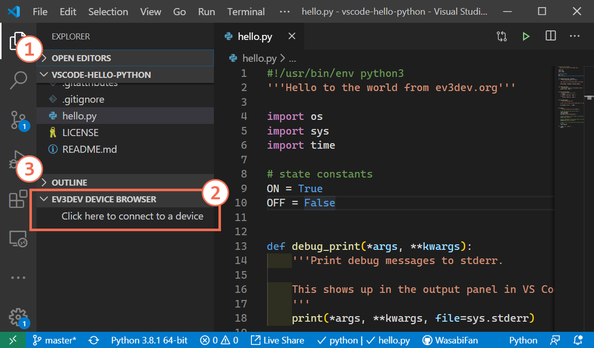
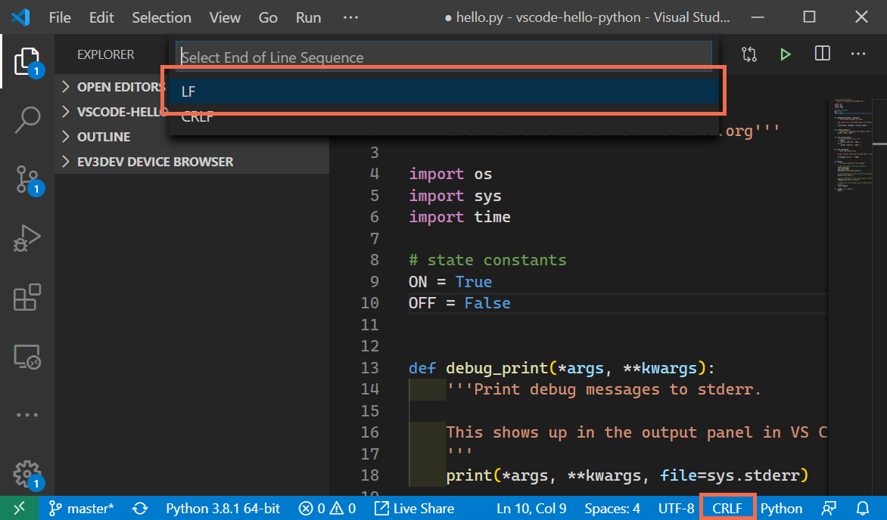

Common Issues with ev3dev-lang-python
=====================================

``ImportError: No module named ev3dev2``
----------------------------------------

This likely means you are running the script on your computer rather than on the
EV3 (or other ev3dev platform). You can run it using our
`Visual Studio Code extension`_ by connecting to a device from the "Explore" tab
on the left and then going to the debug tab, selecting "Run and Debug", and
choosing the ev3dev option.

``/usr/bin/env: 'python3\r': No such file or directory``
--------------------------------------------------------

This means your file includes Windows-style line endings
(CRLF--carriage-return line-feed), which are often inserted by editors on
Windows. To resolve this issue, open an SSH session and run the following
command, replacing ``<file>`` with the name of the Python file you're
using:

.. code:: shell

    sed -i 's/\r//g' <file>

This will fix it for the copy of the file on the brick, but if you plan to edit
it again from Windows, you should configure your editor to use Unix-style
line endings (LF/line-feed). In Visual Studio Code, there is an option in the
lower-right corner.

For PyCharm, you can find a guide on doing this
`here <https://www.jetbrains.com/help/pycharm/2016.2/configuring-line-separators.html>`_.
Most other editors have similar options; there may be an option for it in the
status bar at the bottom of the window or in the menu bar at the top.

``Exception: Unsupported platform 'None'``
------------------------------------------

If you are on a Raspberry Pi, you probably forgot to `update config.txt`_.

Using BrickPi 3: sensors aren't found
-------------------------------------

The BrickPi can't automatically detect what sensors are plugged in, so you need
to tell it. See the `BrickPi 3 demo`_.

.. _update config.txt: https://www.ev3dev.org/docs/getting-started/#step-3a-raspberry-pi-only-update-options-in-configtxt
.. _Visual Studio Code extension: https://github.com/ev3dev/vscode-ev3dev-browser
.. _BrickPi 3 demo: https://github.com/ev3dev/ev3dev-lang-python-demo/blob/stretch/platform/brickpi3-motor-and-sensor.py