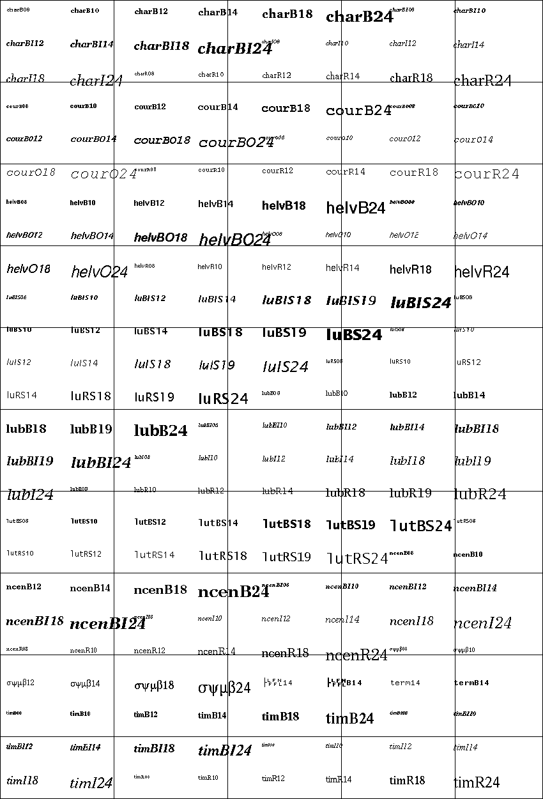

Other classes
=============

.. currentmodule:: ev3dev.core

Remote Control
--------------

.. autoclass:: RemoteControl
    :members:
    :inherited-members:

    .. rubric:: Event handlers

    These will be called when state of the corresponding button is changed:

    .. py:data:: on_red_up
    .. py:data:: on_red_down
    .. py:data:: on_blue_up
    .. py:data:: on_blue_down
    .. py:data:: on_beacon

    .. rubric:: Member functions and properties

Beacon Seeker
-------------

.. autoclass:: BeaconSeeker
    :members:
    :inherited-members:

Button
------

.. autoclass:: ev3dev.ev3.Button
    :members:
    :inherited-members:

    .. rubric:: Event handlers

    These will be called when state of the corresponding button is changed:

    .. py:data:: on_up
    .. py:data:: on_down
    .. py:data:: on_left
    .. py:data:: on_right
    .. py:data:: on_enter
    .. py:data:: on_backspace

    .. rubric:: Member functions and properties

Leds
----

.. autoclass:: Led
    :members:

.. autoclass:: ev3dev.ev3.Leds
    :members:

    .. rubric:: EV3 platform

    Led groups:

    .. py:data:: LEFT
    .. py:data:: RIGHT

    Colors:

    .. py:data:: RED
    .. py:data:: GREEN
    .. py:data:: AMBER
    .. py:data:: ORANGE
    .. py:data:: YELLOW

    .. rubric:: BrickPI platform

    Led groups:

    .. py:data:: LED1
    .. py:data:: LED2

    Colors:

    .. py:data:: BLUE

Power Supply
------------

.. autoclass:: PowerSupply
    :members:

Sound
-----

.. autoclass:: Sound
    :members:

Screen
------

.. autoclass:: Screen
    :members:
    :show-inheritance:

Bitmap fonts
^^^^^^^^^^^^

The :py:class:`Screen` class allows to write text on the LCD using python
imaging library (PIL) interface (see description of the ``text()`` method
`here <http://pillow.readthedocs.io/en/3.1.x/reference/ImageDraw.html#PIL.ImageDraw.PIL.ImageDraw.Draw.text>`_).
The ``ev3dev.fonts`` module contains bitmap fonts in PIL format that should
look good on a tiny EV3 screen:

.. code-block:: py

    import ev3dev.fonts as fonts
    screen.draw.text((10,10), 'Hello World!', font=fonts.load('luBS14'))

.. autofunction:: ev3dev.fonts.available

.. autofunction:: ev3dev.fonts.load

The following image lists all available fonts. The grid lines correspond
to EV3 screen size:

Lego Port
---------

.. autoclass:: LegoPort
    :members:
